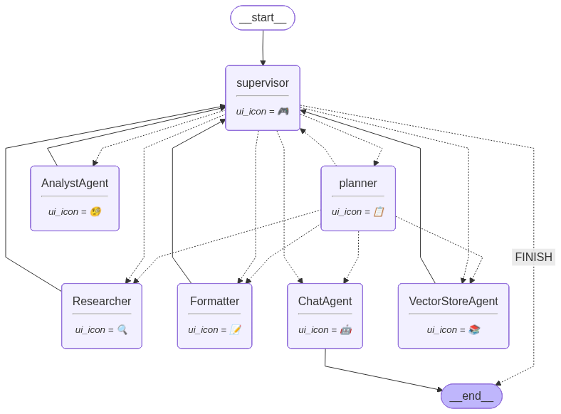
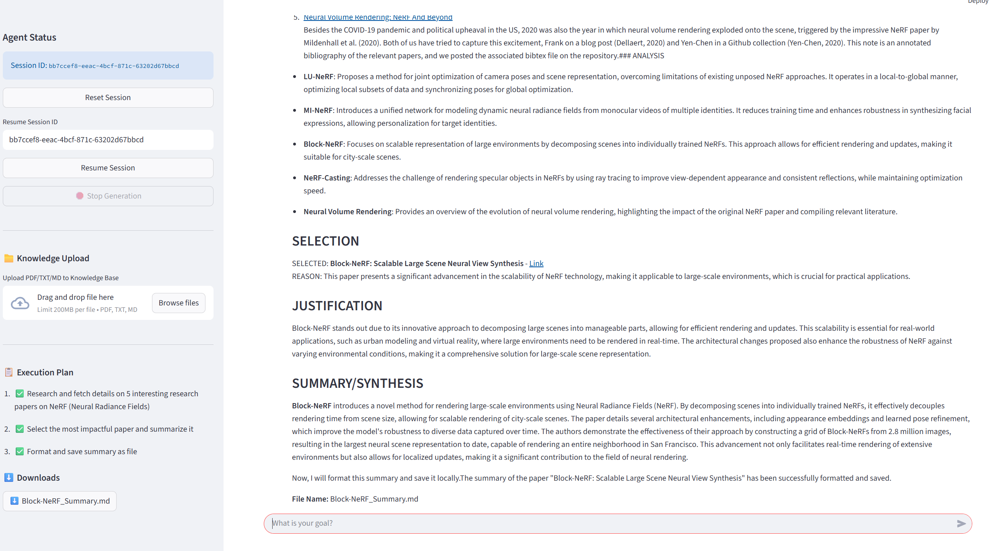
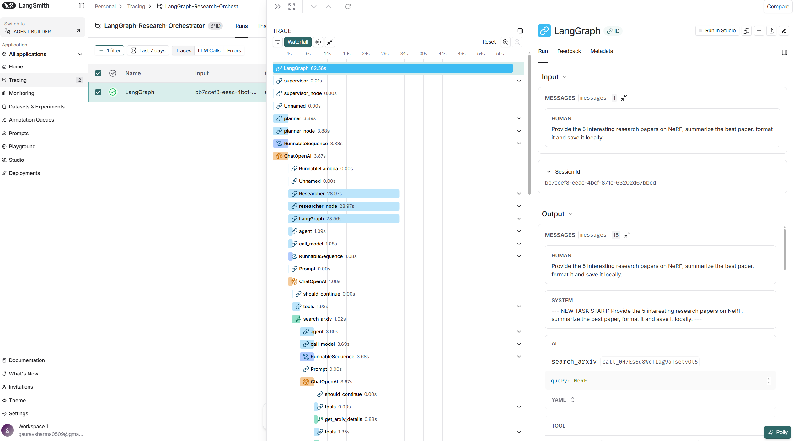

# LangGraph Research Orchestrator

## 🚀 Overview
**LangGraph Research Orchestrator** is a multi-agent system designed for autonomous goal planning, information retrieval, and artifact generation. It uses a "Supervisor + Expert Worker" architecture to handle complex, multi-step tasks that require both server-side processing and client-side interactions.

## 📸 Architecture
Architecture |
:-------------------------:


Frontend Interface |
:-------------------------:


Observability using LangSmith |
:-------------------------:


## ✨ Core Features

### 🧠 Planning & Orchestration
- **Dynamic Supervisor**: A central node that evaluates the current goal, reviews progress, and routes tasks to the most qualified expert agent.
- **Hierarchical Planning**: The system breaks down high-level user goals into executable markdown-formatted plans, visible in real-time.
- **State-Based Execution**: Uses **LangGraph** to maintain a persistent state, allowing for robust error handling, loops, and sequential task completion.

### 📚 Knowledge & Memory
- **Persistent Vector Store**: Uses **ChromaDB** to index and retrieve research notes, full-text papers, and user documents.
<!-- - **Local Knowledge Base**: Powered by a **Model Context Protocol (MCP)** server for managing structured session memory and persistent text snippets. -->
- **Session History**: Full conversation persistence allowing users to resume research threads via unique Session IDs.
- **Structured Logging**: Per-session audit logs that track every tool call, routing decision, and internal message for transparency.

### � Intuitive Frontend
- **Real-time Trace**: A persistent "Execution Trace" in the UI shows exactly which agent is working and what tools are being called.
- **Interactive Sidebar**: Dynamic plan updates (✅/🎯/📝) and an artifact download gallery.
- **Rich document Support**: Integrated file uploader for PDF, TXT, and MD ingestion directly into the agent's knowledge base.

### 💻 CLI Terminal Interface
- **Standalone Terminal Access**: A full-featured CLI for low-latency interactions without a browser.
- **Session Resumption**: Resume any conversation thread via the CLI using `--session-id`.
- **Live Worker Logs**: Real-time terminal output showing worker node activation (Controller, Researcher, etc.).

## 🛠️ Agent Capabilities

### 🖥️ Server-Side Actions (Tools)
The agent performs "real work" using a suite of dedicated tools:
1. **Multi-Source Retrieval**: Searches **Hacker News** and **Arxiv** for the latest technical data.
2. **Deep Content Extraction**: Fetches and cleans full-text content from URLs (including `ar5iv` for research papers).
3. **Artifact Generation**: Dynamically creates **PDFs** and **Markdown** reports based on analysis.
4. **Knowledge Ingestion**: Indexes content into **ChromaDB** for cross-agent retrieval.
5. **Session Management**: Saves and retrieves conversation turns via a local SQLite database.

### 🌐 Client-Side Actions (UI)
The system triggers observable behaviors in the browser:
1. **Dynamic Downloads**: Automatically generates download buttons for reports as soon as they are ready.
2. **UI State Updates**: Real-time manipulation of the "Execution Plan" and "Trace" components to reflect agent reasoning.
3. **Confetti & Feedback**: Visual cues to signal task completion and artifact availability.

## 📁 Project Structure
```
LangGraph-Research-Orchestrator/
│
├── assets/                 # Architecture diagrams and UI screenshots
├── src/                    # Core source code
│   ├── agent/              # Graph logic, Prompts, and Tools
│   ├── client/             # Streamlit Frontend (app.py)
│   ├── server/             # FastAPI Backend & Event Generator
│   ├── scripts/            # CLI, Ingestion scripts, and CLI client
│   └── tests/              # Agent logic and integration tests
├── data/                   # ChromaDB and SQLite persistent storage
├── output/                 # Dynamically generated artifacts (PDFs, MDs)
├── logs/                   # Audit logs for tool calls and routing
├── .env                    # LLM and LangSmith configuration
├── pyproject.toml          # Environment management with UV
└── README.md               # Documentation
```

## 🛠️ Setup & Usage

### 1. Requirements
- Python 3.10+
- [uv](https://docs.astral.sh/uv/) (Recommended) or pip
- OpenAI API Key

### 2. Configuration (.env)
Create a `.env` file in the root directory and populate it with your keys:
```env
# Core LLM
OPENAI_API_KEY="sk-..."


# (Optional) LangSmith for Observability
LANGCHAIN_TRACING_V2=true
LANGCHAIN_ENDPOINT="https://api.smith.langchain.com"
LANGCHAIN_API_KEY="lsv2_pt_ ..."
LANGCHAIN_PROJECT="LangGraph-Research-Orchestrator"

# Database Configuration (Defaults provided in code)
# DB_PATH="data/checkpoints.db"
```

### 2. Installation
```bash
git clone https://github.com/gaurav00700/LangGraph-Research-Orchestrator.git
cd LangGraph-Research-Orchestrator
uv sync
```

### 3. Execution
**Step A: Start Backend**
```bash
uv run uvicorn src.server.main:app --reload --port 8000
```
**Step B: Start UI**
```bash
uv run streamlit run src/client/app.py
```

**Step C: Start CLI (Alternative to UI)**
```bash
# Start a new session
uv run python src/scripts/chatbot_cli.py

# Resume an existing session
uv run python src/scripts/chatbot_cli.py --session-id <YOUR_SESSION_ID>
```

### 4. Data Ingestion (Manual)
While you can upload files directly through the Streamlit UI, you can also ingest documents into the Vector Store manually using the provided script:
```bash
# Ingest a PDF into the persistent Vector Store (ChromaDB)
uv run python src/scripts/ingest_file.py --file_path path/to/your/document.pdf
```
Supported formats: `.pdf`, `.txt`, `.md`.


## 🔒 Control & Safety
- **Tool-Call Auditing**: Every tool call is logged to a `logs/` directory for review.
- **Plan Transparency**: The agent's plan is displayed *before* significant execution, allowing users to monitor intent.
- **Safe Execution**: File operations are restricted to the local `output/` directory, and web interactions are read-only.

## ⚠️ Known Limitations & Tradeoffs
- **Incremental Rendering**: Real-time markdown streaming may cause minor UI flicker.
- **Token Efficiency**: Complex research tasks can involve multi-step LLM calls; usage of LangSmith for monitoring is recommended.
- **Model Choice**: Optimized for GPT-4o-mini; smaller models may require prompt tuning for tool accuracy.

## 🧪 Proof of Behavior (Web Proof)
- **Network Logs**: Every UI update is driven by a streaming SSE (Server-Sent Events) endpoint at `/chat`.
- **System Trace**: Use the "Execution Trace" in the UI sidebar to see the interaction between the Supervisor and Workers in real-time.
- **Persistence**: Restart the UI and enter your previous `Session ID` to see your research and artifacts perfectly preserved.
